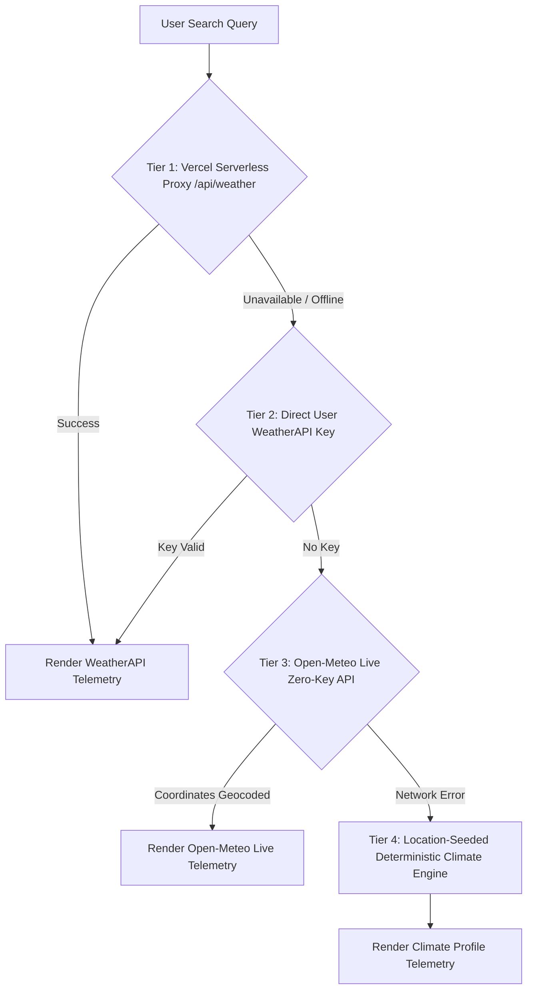

# Atmos — Field Weather Instrument 🌩️🧭

<div align="center">

[](https://weather-app-sigma-ruddy-75.vercel.app/)
[](https://weather-app-sigma-ruddy-75.vercel.app/)
[](https://weather-app-sigma-ruddy-75.vercel.app/)
[](LICENSE)

[](https://developer.mozilla.org/en-US/docs/Web/JavaScript)
[](https://developer.mozilla.org/en-US/docs/Web/HTML)
[](https://developer.mozilla.org/en-US/docs/Web/CSS)
[](https://leafletjs.com/)
[](https://open-meteo.com/)
[](https://en.wikipedia.org/api/rest_v1/)

<p align="center">
  <b>A modern, high-precision web instrument panel for real-time weather telemetry, scientific air quality metrics, nearby cultural attractions, interactive GIS mapping, and side-by-side location comparisons.</b>
</p>

[🌐 **Explore Live Web Application**](https://weather-app-sigma-ruddy-75.vercel.app/) · [🐛 Report Issue](#-support--contributing) · [📖 Features Showcase](#-key-features)

---

</div>

## 🌐 Live Web Application

The production application is deployed live on Vercel:

> 🔗 **App URL:** [https://weather-app-sigma-ruddy-75.vercel.app/](https://weather-app-sigma-ruddy-75.vercel.app/)

---

## 🌟 Key Features

Atmos transforms traditional weather text into a **precision telemetry instrument panel**:

### 1. ⚡ High-Precision Weather Telemetry
* **Global Search Scope**: Accepts city names, villages, state territories, countries, postcodes, airport IATA codes, and latitude-longitude coordinate pairs (e.g. `Jaipur`, `Lucknow`, `Manali`, `Tokyo`, `28.61, 77.20`).
* **Signature Solar Sky Strip**: Solar arc timeline displaying live sun position across a 24-hour day/night gradient curve.
* **8-Point Field Gauges**:
  * 🧭 **Wind Rose Compass**: Dynamic directional needle with wind speed in km/h or mph.
  * 🌡️ **Barometer Meter**: Surface pressure gauge with barometric tendency indicators (`hPa`).
  * ☀️ **Solar UV Arc**: Color-coded solar UV index scale with skin protection advice.
  * 💧 **Humidity & Dew Point**: Atmospheric moisture saturation levels.
  * 👁️ **Visibility Range**: Distance horizon index in kilometers or miles.
  * 🌔 **Lunar Phase Disc**: Precise moon phase visualization (New Moon, Waxing Crescent, Full Moon, Waning Gibbous).
  * 📉 **12-Hour Outlook Strip**: Hourly temperature forecast with precipitation probability.

### 2. 🧪 Scientific Air Quality (AQI) Command Center
* **US EPA & GB DEFRA Standards**: 6-level air cleanliness index gauge with health advisories for sensitive groups.
* **Particulate Concentration Chips**: Real-time measurement of key pollutants in $\mu g/m^3$:
  * **PM2.5** & **PM10** fine particulate matter
  * **CO** (Carbon Monoxide)
  * **NO2** (Nitrogen Dioxide)
  * **O3** (Ozone)
  * **SO2** (Sulfur Dioxide)

### 3. 🏛️ Visitable Places & Cultural Landmark Explorer
* **Curated Landmark Map**: Instant high-quality attraction profiles for major destinations worldwide (e.g. *Lucknow*: Bara Imambara, Rumi Darwaza, Chota Imambara, Ambedkar Park, British Residency; *Manali*: Hadimba Devi Temple, Solang Valley, Rohtang Pass; *Jaipur*: Hawa Mahal, Amber Fort, City Palace).
* **Location-Scoped Wikipedia REST Integration**: Dynamic fetcher queries Wikipedia REST API for any location worldwide with strict administrative filtering (excludes railway divisions, constituencies, elections, corporate listings).
* **Interactive Attraction Cards**: Displays high-resolution photography, extract summaries, direct Wikipedia guide links, and one-click Google Maps directions (`🗺️ Directions`).

### 4. 🗺️ Interactive Topographic Map
* **Leaflet OpenStreetMap Integration**: Custom dark-themed Leaflet GIS map centering on the searched location with spatial coordinate badges (Latitude, Longitude, Region).

### 5. ⚖️ Side-by-Side Location Comparison
* Compare two cities or regions simultaneously in a dedicated comparison modal panel.

### 6. 📋 Instant Report Exporter
* One-click clipboard exporter generates a formatted text telemetry report ready for sharing.

---

## 🏗️ Multi-Tier Architecture & Fallback Engine

Atmos operates on a **resilient 4-tier weather engine pipeline** ensuring zero downtime:



1. **Tier 1 — Vercel Serverless Function (`/api/weather`)**: Server-side WeatherAPI proxy with 5-minute forecast caching and hidden environment variable keys.
2. **Tier 2 — Direct API Key**: Client-side WeatherAPI key option configurable in Settings modal (`⚙️`).
3. **Tier 3 — Zero-Key Live Engine (Nominatim + Open-Meteo)**: Automatic geocoding via OpenStreetMap Nominatim and live weather telemetry from Open-Meteo API. **Requires zero API keys.**
4. **Tier 4 — Location-Seeded Deterministic Climate Generator**: Offline fallback profiler that generates location-matched climate profiles (alpine snow for Kashmir/Iceland, high thermal for desert regions) using deterministic string hashing.

---

## 🎨 Design System & Aesthetics

Atmos features a **dark-mode glassmorphic interface** crafted with Vanilla CSS3:

| Element | Description |
| :--- | :--- |
| **Color Tokens** | Deep Space Ink (`#070d19`), Electric Cyan (`#54ead2`), Warm Amber Gold (`#f8bd58`), Rose Alert (`#ff7d9c`) |
| **Typography** | `Fraunces` serif (editorial headlines), `JetBrains Mono` (numerical telemetry), `Inter` (body copy) |
| **Glassmorphism** | Translucent cards with `backdrop-filter: blur(18px)` and glowing border halos |
| **3D Instrument** | Animated Holographic Globe Stage on the hero log book card |

---

## 📂 Project Structure

```
Atmos-Weather-updated/
├── api/
│   ├── weather.js          # Vercel serverless proxy for forecast & AQI telemetry
│   └── search.js           # Vercel serverless proxy for location autocomplete
├── index.html              # Clean HTML5 structure & semantic bento layout
├── index.css               # Complete design system CSS, variables & animations
├── script.js               # Client logic, Open-Meteo pipeline, Wikipedia engine
├── favicon.png             # Application brand favicon
├── package.json            # Node.js manifest for Vercel deployment
├── README.md               # Documentation & deployment guide
└── .env.example            # Environment variables template
```

---

## 🛠️ Local Development & Setup

### Prerequisites
* Node.js v16+ (optional for local Vercel CLI development)
* Web browser (Chrome, Firefox, Edge, Safari)

### Quick Start Options

#### Option A: Direct Static Server (Zero-Key Live Mode)
You can serve the static files directly using any local HTTP server (e.g. `npx http-server` or VS Code Live Server). Atmos will automatically leverage the **Tier 3 Open-Meteo zero-key engine**:

```bash
# Clone or navigate to the directory
cd Atmos-Weather-updated

# Serve locally
npx http-server -p 8080
```
Open `http://localhost:8080` in your browser.

#### Option B: Full Vercel Serverless Development
To test the `/api/weather` and `/api/search` serverless functions locally:

```bash
# 1. Install Vercel CLI
npm install -g vercel

# 2. Set up environment variable
cp .env.example .env
# Edit .env and paste your WeatherAPI key:
# WEATHERAPI_KEY=your_actual_key_here

# 3. Start local development server
vercel dev
```

---

## 🚀 Deploying to Vercel

1. Push code to your GitHub / GitLab / Bitbucket repository.
2. Import the project into your [Vercel Dashboard](https://vercel.com).
3. Add Environment Variable in Vercel:
   * **Key**: `WEATHERAPI_KEY`
   * **Value**: *Your WeatherAPI Key*
4. Click **Deploy**. Vercel will automatically configure serverless endpoints for `/api/weather` and `/api/search`.

> Live Production Link: **[https://weather-app-sigma-ruddy-75.vercel.app/](https://weather-app-sigma-ruddy-75.vercel.app/)**

---

## 📜 API Providers & Data Sources

* **Weather & Forecast**: [WeatherAPI.com](https://www.weatherapi.com/) & [Open-Meteo.com](https://open-meteo.com/)
* **Geocoding**: [OpenStreetMap Nominatim](https://nominatim.openstreetmap.org/) & Open-Meteo Geocoding
* **Attractions & Photography**: [Wikipedia REST API](https://en.wikipedia.org/api/rest_v1/) & Wikimedia Commons
* **Topographic Maps**: [Leaflet.js](https://leafletjs.com/) & [OpenStreetMap](https://www.openstreetmap.org/)

---

## 📄 License

Distributed under the **MIT License**. See `LICENSE` for more information.

---

<div align="center">
  <b>Atmos — Read weather like an instrument panel.</b><br>
  Built with ❤️ for precision telemetry and global exploration.
</div>
